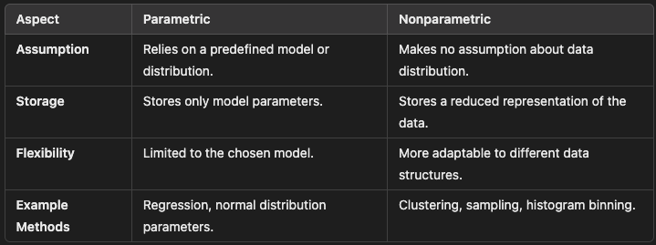

# Introdução

- First of all, the chapter talks about the recent evolution of the data scenarious that made us come to the Big Data era.
- Also, an important thing that the author writes is about the steriotype of the Big Data (talking about the ones who think
  only about the big data size, but not about the other important things, such as variety and velocity).
- It value -> business value ( or the data isnt useless).
- The main big data resources.
- The big jump from the 90s about the amout of avaible data.

## Chalenges of the traditionals SGBDs
- Increasing data volume to large scales makes expensive to expand the systems capacities.
- The SGBDs cant handle the new data structure, that can be non or semi structured.
- The data velocity couldnt be handled by the database systems.
- WORM Paradigm in Big Data
  - Immutable data stored in the database

## 3 Vs
- Volume, Velocity and Variety (Unstruc, semi and struc)

## Big Data Infraestructure
- The core of the big data is dealing with the Vs of the Big Data and, because of that, some techs and tools for big data handling appeared
  in the tech market, that allows analysts to capture, transform, store, manage and analyse this massive data.
- In addition, the core is also based in the idea of the low cost scalabilitie of the SGBDs with the evolution of the Vs.

### Hadoop environment
- The Hadoop is an open source plataform that handles the great quantity of big data in nowadays, allowing to deal with all the big data cycle in a 
distributed designed computing system, processing the data in parallel.
- One important thing to know is that the Hadoop Files are WORM, what make them immutable by anyone, but readable for the permited ones.
- The HDFS is the storing part of Hadoop environ, as MapReduce is the processing one.
- Also, the YARN - Yet Another Resource Negotiator is one of the components for distributed processing
- Hadoop Common is a collectiobn of common utilities

## Big data LifeCycle
- Generated
- Collected
- Preprocessed
  - Integration
  - Cleaning
  - Reduction
    - In data Reduction, we saw the parametric and Non parametric methods for numerosity reduction.
    - 
    - The parametric methods consists in storing only the attributes parameters, such as mean and std, assuming that they have some specific distribuction. Instead, the nonparametric methods consists in storing reduced samples of the datasets, representactive, obviously. Nos paramétricos, podemos armazenar também os parâmetros de uma regressão entre duas variáveis, que sejam representativos para este modelo.
  - Transformation
    - Smoothing
    - Aggregation
    - Generalization
    - Discretization (Put data into classes)
- Stored
- Analysis Layer - Processed
  - Capitalize in this massive quantity of data
  - Fusion of big data technologies and analytics tools
  - Predictive, prescriptive and descriptive analytics
- Visualization
  - The correct charts for each 
  - Extract key insights

## Challenges of Big Data
- Heterogeneity and incompleteness
- Volume and velocity of the data
- Data storage
- Data privacy

## Big data Applications
The capacity of the Big Data's environments in nowadays allows lots of applications for those. Such as: 
- Healthcare sector
- Web Analysis
- Banking and Securities
- Marketing
- Web Anaslysis
- Call Center Analytics